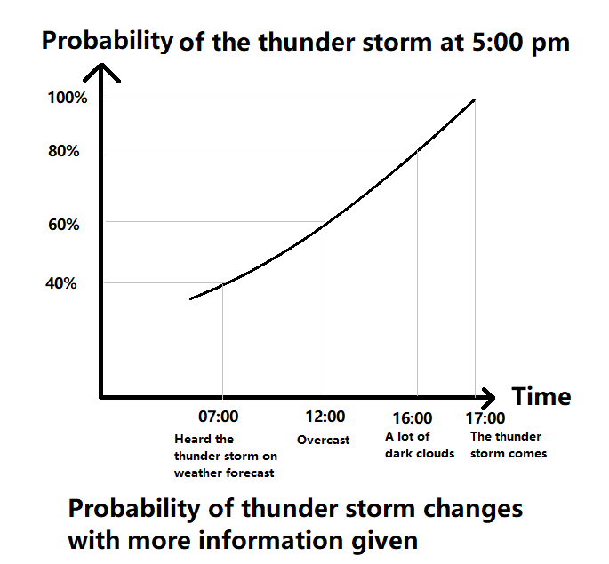

Just imagine it is 7:00 in the morning, you are having your breakfast while listening to the weather forecast. The weatherman predicts that there will be a thunder storm at 5:00 in this afternoon. 

Based on your experience, you assume the chance of the thunder storm is only 40% at this time of the year. Using probabilistic term, that is P(TS)=0.4, where TS stands for having that thunder storm. 

After two lectures in the morning, you are heading to the cafeteria with your classmates at 12:00 pm. Suddenly, you look up in the sky and realize it is overcast now. The probability of having that thunder storm increases in your mind to 60%. 

Now, we have P(TS | Overcast at 12)=0.6 called conditional probability. It means the chance of the thunder storm at 5:00 pm is 60%, given the condition of being overcast at 12:00 pm.

After finishing your lab at 4:00 pm, you look through the window and recognize that there are a lot of dark clouds in the sky. At this moment, you surely adjust the probability of having the thunder storm to 80% by setting P(TS | Dark clouds at 4)=0.8. 

When you arrive home at 5:00 pm, the thunder storm comes. Now, the conditional probability P(TS | TS at 5)=1.

This increase in probability is shown in the following plot:

According to probability theory, conditional probability is the probability of an event happening (the thunder storm), given the condition that another event has happened(dark clouds in the sky). It means giving some information of one thing may change the probability of another thing happening.

Conditional probability is very important not only in research such as statistics and data science, but also in our daily lives. Knowing what conditional probability really means can change our way of seeing the world.

Here is a story about David and his watermelon. David bought a watermelon from a farmer, and planned to give it to his girlfriend as a gift. The farmer is famous for growing delicious watermelons and only 1% of his watermelons do not taste good. To make sure that he bought the tasty watermelon, David downloaded an app using the image of the watermelon to test whether it tasted good, and the developer of the app claimed that the test was 95% accurate.

Unfortunately, the test result was negative. In this case, the chance that David might give his girlfriend the bad watermelon is pretty high, right? But wait. Before throwing this watermelon into the garbage bin, David might want to use the conception of conditional probability to think this through.

Let’s use B to represent David buying the bad watermelon and N to present the negative result. Based on the claim that the test is “95% accurate”, we have P(N | B)=0.95. What we would like to calculate is the probability that David bought the bad watermelon given the information that the test result is negative, i.e. P(B | N).

As future data scientists, we have all learnt the Bayes’ rule and the law of total probability. We can use them to get the following result:

P(B | N)=0.16

Therefore, there is only a 16% chance that David bought a bad watermelon even though the test result was negative.

Pretty surprising, right? Although the app is 95% accurate and the test result was negative, the probability of David getting a bad watermelon is only 16%. The probability of a wrong test result is low, but the probability of getting a bad watermelon before the test is only 1%, which is even lower. 

People indent to use probability instead of conditional probability to think. For example, people is more likely to think "the test is 95% accurate" means that the probability of David bought a bad watermelon is 95% if the test result is negative. However, "the test is 95% accurate" means that the probability of the test is wrong if we have already known it is a bad watermelon, which is the conditional probability P(test result is negative | the watermelon is bad)=0.95 instead of P(the watermelon is bad | test result is negative)=0.95.

Deep understanding of the conditional probability helps us analyze many problems accurately and gives us a more precise picture of the world.

— *The examples in this blog were inspired by “Introduction to Probability” by Joseph K. Blitzstein and Jessica Hwang.*
